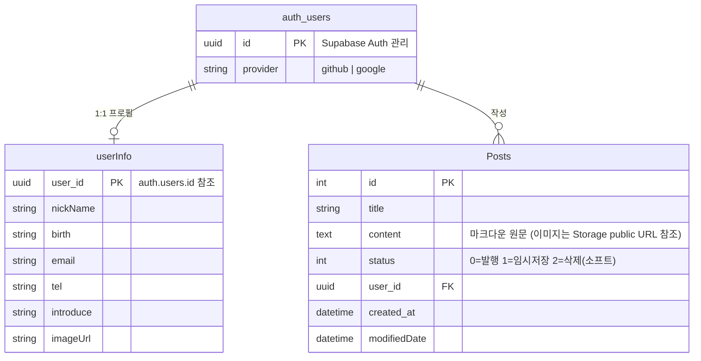

# myBlog 프로젝트 정리

> 저장소: [DoHyuk-Centric/myBlog](https://github.com/DoHyuk-Centric/myBlog) · 배포: [dohyuk.dev](https://dohyuk.dev)
> 기간: 2026.01.08 ~ 2026.07.11 (커밋 180개, 병합 PR 20개+) · 프레임워크 없는 Vanilla JS MPA (Vite 멀티페이지 빌드) + Supabase(BaaS)

이 문서는 전체 커밋 히스토리(`git log`)와 소스 코드를 직접 조회해 정리한 작업 기록입니다.

---

## 1. 구현 기능 정리

### 1.1 핵심 기능

프로젝트의 핵심 가치를 이루는 세 가지입니다.

| 기능 | 설명 |
|---|---|
| **자체 npm 패키지 개발 — `markdown-block-preview`** | 마크다운 글쓰기 중 "블록(문단) 단위 실시간 미리보기" 라이브러리가 없어 직접 만들어 [npm](https://www.npmjs.com/package/markdown-block-preview)에 배포. 변경된 블록만 다시 렌더링해 전체 재렌더 대비 최대 **8.2배** 빠름(50블록 벤치마크). |
| **게시글 CRUD + 임시저장/휴지통 상태 머신** | `status` 0(발행)/1(임시저장)/2(휴지통) 3단 상태로 글쓰기 플로우 전체를 관리. 임시저장 목록, 이어쓰기, 소프트 삭제까지 커버. |
| **이미지 지연 업로드 패턴** | 에디터에서는 `blob:` 프리뷰 URL만 사용하고, **발행 시점에만** 실제 Storage 업로드 + 마크다운 URL 치환. 임시저장/작성 중 이탈 시 불필요한 업로드를 막는 설계. |

### 1.2 기능 목록 (커밋 기준 시간순 요약)

**캘린더 / 공휴일**
- 연도·월 선택 캘린더 UI, 부드러운 탭 전환 인터랙션 (`2026-01-08` ~ `01-16`)
- 공휴일 데이터 연동 — Supabase Edge Function(`get-holidays`)으로 공공데이터포털 API 프록시, 날짜 클릭 시 토글 표시 (`02-18`)

**인증**
- Firebase Google/GitHub 로그인 최초 도입 (`01-19`) → 이후 **Supabase Auth로 전환**(`02-08`, `🚨 firebase 인증 → supabase 인증`)
- `localStorage` 기반 로그인 상태 관리 → 비동기 세션 체크로 개선 (`01-20`, `03-14`)
- 로그인 여부에 따른 UI 분기(글쓰기 버튼, 프로필 접근 등)

**게시판(devLog) / 게시글(Post)**
- 게시글 DB 연동(비동기 처리), 목록/상세 페이지 구현 (`02-02`)
- 마크다운 구조로 본문 저장 방식 변경 (`02-03`)
- 게시글 상세: 모바일 더보기 버튼, aside 목차(TOC), 레이아웃 개선 (`02-07`)
- 소유자만 수정/삭제 가능하도록 소유권 검증 로직 분리(`checkPostOwner`) (`02-19`)
- 임시저장 기능: `status` 3단 분기, 중복 작성 방지, 임시글 목록 UI (`03-15` ~ `03-17`)
- `markdown-block-preview` 적용 및 미리보기 로직 교체 (`03-20`)
- 목록 페이지네이션(페이지 증가 시 목록화) (`03-20`)
- 이미지 업로드 버그 수정, 링크 삽입 버튼 (`03-18`, `03-21`)

**프로필**
- 내 정보 페이지 + 사용자 정보 저장 테이블(`userInfo`) 생성 (`02-12`)
- 자기소개글 DB 연동, 프로필 이미지 업로드/조회 (`02-14`, `02-17`)
- 생년월일 입력 자동완성(`YYYY-MM-DD` 자동 하이픈) (`02-17`, `02-18`)
- 닉네임 컬럼을 조회해 실제 지정 닉네임으로 표시하도록 수정 (`03-14`)

**About 페이지**
- 드래그 가능한 카드 UI로 "프로젝트 개요 / 핵심 기능·구현 / 기술 스택·아키텍처" 구성 (`02-23`)
- 반응형 3단계(모바일/태블릿/데스크탑) 대응 (`02-25`, `02-27`)
- 실시간 시계 렌더링, 모바일 전용 아이콘/디자인 (`02-26`)
- **모바일 = 삼성 One UI, 데스크탑 = Windows XP 테마**를 모사한 인터랙션 디자인 — 카카오톡/Gmail/Chrome(티스토리 iframe)/윈도우 탐색기(깃허브·오픈채팅 바로가기) 재현 (`02-26` ~ `03-04`)
- JS 모듈 구조 리팩터링(함수 rename+export 정리, 폴더 단위 컴포넌트화) (`03-06`, `03-07`)

**홈/인덱스**
- 캔버스 별/워프 애니메이션 랜딩 페이지, 스크롤 시 컨텐츠 페이드인 (`03-07` ~ `03-13`)
- 다크모드 대응 로고 색 반전

**공통/기타**
- 다크모드 토글(이미지·색상 세트 전환)
- 반응형 헤더/메뉴, 이용약관·개인정보처리방침 페이지
- 404 페이지, 비로그인 접근 차단(`blockAccess`)

### 1.3 문서화 작업 (2026-07-11, 별도 세션)
- README의 패키지 사용 예제 수정, `.env` 시크릿 git 추적 해제 + 재발 방지 스크립트/CI
- v2.0.0 Next.js/NestJS 전환 설계 문서, DB ERD·삭제 자동화 설계 문서
- `markdown-block-preview`의 React 전환 적합성 검토 + 실수요 조사 문서

---

## 2. 문제 해결 과정

레포에 남아있는 실제 설계/회고 문서를 근거로, "문제 정의 → 원인 → 해결책 설계/선택 → 구현 및 검증" 순서로 정리했습니다.

### 2.1 인증 수단 교체 — Firebase → Supabase

- **문제 정의**: 초기(`01-19`)에 Firebase로 Google/GitHub 로그인을 붙였으나, 이미 DB(Posts/프로필)를 Supabase Postgres로 쓰기로 결정한 상태라 인증 공급자가 이원화됨.
- **원인**: Firebase Auth의 사용자 식별자와 Supabase Postgres의 `user_id` 외래키를 정합성 있게 묶기 어려움 — 인증과 데이터가 다른 공급자에 있으면 RLS(행 단위 보안)로 소유권을 강제할 수 없음.
- **해결책 설계 및 선택**: 인증까지 Supabase Auth(GitHub/Google OAuth)로 일원화. Firebase는 인증 레이어에서 완전히 제거.
- **구현 및 검증**: `🚨 firebase 인증 → supabase 인증`(`02-08`) 커밋으로 전환, 이후 `checkPostOwner.js`가 `supabase.auth.getUser()`의 `user.id`와 `Posts.user_id`를 직접 비교하는 방식으로 소유권 검증을 구현·검증. **`components/login/firebase.js`는 제거되지 못한 죽은 코드**로 남아있음(아래 §5 참고).

### 2.2 markdown-block-preview — 자체 패키지 개발 배경과 알고리즘 선택

- **문제 정의**: 마크다운 에디터에서 입력할 때마다 미리보기 전체를 다시 렌더링하면, 글이 길어질수록 타이핑이 버벅임.
- **원인**: `marked.parse()`로 전체 문서를 매번 재파싱하고 `innerHTML`을 통째로 교체하는 방식이 문제 — 실측(§3.2)상 병목은 파싱이 아니라 **DOM 트리 재구성 비용**.
- **해결책 설계 및 선택**: 빈 줄 기준으로 문서를 블록 단위로 나누고(`splitMarkdownBlocks`), 이전 블록 배열과 비교해 **바뀐 블록만** DOM에 반영(`syncBlockStructure`). 구조가 바뀌면 전체 재구성으로 폴백.
- **구현 및 검증**: 별도 npm 패키지로 분리 개발·배포. README 벤치마크로 "1블록 변경 시 8.2배, 10블록 변경 시 3.8배" 개선을 수치로 검증. 이 프로젝트(`postCreate` 에디터)에는 `markedControler.js`를 통해 적용(`03-20`).

### 2.3 (문서화) markdown-block-preview의 Next.js/React 전환 적합성 검토

v2.0.0 전환을 설계하며 실제로 벤치마크를 돌려 의사결정한 사례입니다.

- **문제 정의**: Next.js 전환 시 Vanilla DOM 조작 기반인 이 패키지를 그대로 쓸 수 있는가?
- **원인**: SSR 시점엔 `document`가 없고, 패키지가 직접 건드리는 실제 DOM이 React의 파이버 리컨실리에이션과 충돌할 수 있어 React 래퍼로 감싸는 방안은 기각.
- **해결책 설계 및 선택**: "패키지를 그대로 이식"이 아니라 **"블록 단위 증분 렌더링이라는 아이디어"만** `splitMarkdownBlocks`(순수 함수) + `React.memo` + `key` 조합으로 재구현하는 방향을 검토.
- **구현 및 검증**: jsdom·Playwright(실제 Chromium)로 3단계 실측(파싱 vs DOM 비용 분리 → 블록 수별 naive 성능 → 7,000줄 극단 케이스)을 진행. 결론: **이 블로그 글 규모(수십~수백 줄)에서는 naive 구현으로 충분**, 알고리즘 이식은 오버엔지니어링으로 판단해 채택하지 않음(§3에 상세 수치).

### 2.4 README 문서 드리프트 + `.env` 시크릿 노출

- **문제 정의**: (1) README의 패키지 사용 예제가 실제로 존재하지 않는 API(`BlockPreview`)를 쓰고 있었고, (2) `.env`와 `supabase/functions/.env`가 공개 저장소에 커밋되어 공공데이터포털 인증키(`HOLIDAY_KEY`)가 노출됨.
- **원인**: (1) 패키지 API가 바뀌었는데 README를 갱신하지 않은 문서 드리프트(실제 호출부 `markedControler.js`는 올바른 API 사용 중이었음). (2) 초기 서버 구성 커밋(`b41c5f0`)부터 `.gitignore`에 `.env`가 빠져 있었음.
- **해결책 설계 및 선택**: README를 실제 호출부에 맞춰 수정 + "SPA"라는 잘못된 소개 문구도 실제 구조(MPA)로 정정. 시크릿은 히스토리 재작성(force-push) 대신 **키 로테이션**으로 대응하기로 결정(과거 커밋을 지워도 GitHub이 원본 객체를 당분간 보관하므로 히스토리 정리는 근본 해결이 아니라고 판단).
- **구현 및 검증**: `git rm --cached`로 추적 해제(워킹트리 파일은 보존해 로컬 빌드는 그대로 동작), `.gitignore`/`.env.example` 정비, 재발 방지용 `scripts/check-no-tracked-env.sh` + `.github/workflows/secrets.yml`(gitleaks) 추가. 가드 스크립트는 "정상 상태/`.env` 재추적 시도/되돌림/`.env.example`만 추적" 4가지 케이스로 직접 검증. **`HOLIDAY_KEY` 로테이션과 Supabase RLS 재확인은 코드로 해결 불가한 수동 조치로 별도 명시**(§5).

---

## 3. 성능 개선 관련 내용

`markdown-block-preview` 관련 실측이 이 프로젝트에서 유일하게 수치로 남아있는 성능 작업입니다.

### 3.1 실측 1 — 파싱 비용 vs DOM 반영 비용 분리 (jsdom, 50블록 문서·500회 반복)

| 항목 | 평균 |
|---|---|
| 전체 문서 파싱(marked) | 0.98ms |
| 블록 1개만 파싱 | 0.005ms |
| 전체 innerHTML 반영(50블록) | 13.45ms |
| 블록 1개만 innerHTML 반영 | 0.18ms |
| 실제 패키지 end-to-end(1블록 변경) | 0.10ms |
| React naive 시뮬레이션(매번 전체 파싱+반영) | 10.19ms |

→ 병목은 재파싱이 아니라 **DOM 트리 재구성**. React를 쓴다고 저절로 해결되지 않음(`dangerouslySetInnerHTML`에 통짜 문자열을 넣으면 diff 불가).

### 3.2 실측 2 — 블록 수에 따른 naive 방식 한계 (Playwright/Chromium, 300회 반복)

| 블록 수 | naive 평균 | 60fps 예산(16.6ms) 대비 |
|---|---|---|
| 100 | 2.4ms | 여유 |
| 500 | 13.3ms | 여유 |
| 600 | 16.0ms | 경계 |
| **700** | **20.7ms** | **초과** |
| 1200 | 52.4ms | 초과 |

block 방식은 블록 수 무관하게 편집당 0.03~0.07ms로 일정. → **약 600~700블록(3,000~3,500줄)** 부터 naive가 프레임 예산을 넘김.

### 3.3 실측 3 — 실제 패키지 코드로 극단 케이스(8,399줄/1,400블록)

| | npm 패키지 | naive |
|---|---|---|
| 초기 렌더 | 100.5ms | 38.1ms |
| **편집 1회당 비용** | **1.11ms** | 55.09ms (p95 72.7ms) |

초기 렌더는 패키지가 더 느리지만(블록마다 `createElement` 비용), 편집 비용은 **naive 대비 49.5배 빠름**.

### 3.4 결론 및 실제 적용
- 이 블로그(devlog 포스트 수십~수백 줄) 규모에서는 **naive로도 충분**하다고 판단했지만, 실제 프로덕션 에디터(`postCreate`)에는 이미 `markdown-block-preview`가 적용되어 있어 규모가 커져도 안전한 상태.
- 별도 조사(§5 참고)로 "블록 단위 증분 렌더링"이 AI 스트리밍 마크다운 렌더링(챗봇 UI) 분야에서 업계 표준 해법과 개념적으로 동일하다는 점도 확인.
- 이미지 업로드는 **작성 중엔 blob 프리뷰만 사용하고 발행 시점에만 실제 업로드**하는 지연 업로드 패턴으로, 불필요한 Storage 트래픽·임시저장 중 고아 이미지 발생을 줄이는 설계.

---

## 4. 아키텍처 구조

### 4.1 전체 구조 요약

```
[브라우저]
   │  location.href 기반 페이지 이동 (라우터 없음, 중앙 상태관리 없음)
   ▼
[Vite MPA] index.html + pages/*.html(14개) — 진입점마다 필요한 JS만 로드
   │
   ├─ components/*  (기능별 Vanilla JS 모듈)
   └─ src/supabase.js  (Supabase 클라이언트, 전역 단일 인스턴스)
        │
        ▼
[Supabase(BaaS)]
   ├─ Auth      — GitHub/Google OAuth, 세션 관리
   ├─ Postgres  — Posts, userInfo 테이블 (RLS로 행 단위 보안)
   ├─ Storage   — "Post"(게시글 이미지), "profile"(프로필 이미지) 버킷
   └─ Edge Function(Deno) — get-holidays: 공공데이터포털 API 키를 서버리스 레이어에 은닉
        │
        ▼
[공공데이터포털 API] — 공휴일 정보 (외부 서드파티)
```

**핵심 설계 특징**: 클라이언트가 Supabase를 **직접** 호출하는 순수 BaaS 패턴. 유일하게 서버 코드가 필요한 지점(외부 API 키 은닉)만 Edge Function으로 분리했고, `about.html`에 이 흐름을 시각화한 아키텍처 다이어그램 섹션을 별도로 만들어 정리해 둠(`components/about/data/section-architecture-Data.js`).

### 4.2 폴더 구조

```
myblog/
├─ index.html, pages/*.html      # 14개 MPA 진입점 (vite.config.js rollupOptions.input)
├─ src/
│  ├─ main.js, index.js, 404.js  # 공통 부트스트랩 / 랜딩 애니메이션 / 접근 차단
│  ├─ supabase.js                # Supabase 클라이언트 싱글턴
│  └─ style.css, scroll.css, post-layout.css
├─ components/
│  ├─ header/, menu*.js, darkmode/, nav/, fadein/, animations/   # 공통 UI
│  ├─ login/         # OAuth 트리거, 세션 조회, firebase.js(죽은 코드)
│  ├─ crud/          # checkPostOwner.js — 소유권 검증 공용 로직
│  ├─ devLog/        # 목록 조회/페이지네이션, 공휴일 로딩, 프로필 패치
│  ├─ post/          # 상세 로드+TOC, 삭제, 모바일 버튼
│  ├─ postCreate/    # 에디터 툴바, 이미지 업로드, markdown-block-preview 연동, 임시저장
│  ├─ profile/       # 프로필 입력/이미지/생년월일 자동완성
│  └─ about/         # 카드 드래그 UI, 데스크탑(XP)·모바일(One UI) 재현, 섹션별 컴포넌트+데이터 분리
├─ public/           # 폰트(A2Z), 이미지(윈도우 XP·One UI 목업 에셋 등)
├─ supabase/
│  ├─ config.toml
│  └─ functions/get-holidays/index.ts   # Deno Edge Function
├─ scripts/check-no-tracked-env.sh      # .env 재추적 방지 가드
├─ .github/workflows/secrets.yml        # gitleaks + 가드 스크립트 CI
└─ docs/                                # 설계/회고 문서 (2026-07-11 세션)
```

`about` 컴포넌트는 섹션별로 `sections/section-*.js`(로직) + `data/section-*-Data.js`(콘텐츠) + `sections/*/**-templates.js`(마크업)로 3분리되어 있어, 디자인 데이터만 바꿔도 로직을 안 건드리는 구조로 리팩터링됨(`03-06`~`03-07` 커밋).

### 4.3 데이터 흐름

**글 작성 → 발행**
```
postCreate.html
  → inputPostEditor.js (H1~H4/굵게/링크 등 툴바, textarea 직접 조작)
  → markdown-block-preview (실시간 블록 단위 미리보기)
  → [이미지 삽입 시] imgInput() → blob: 프리뷰 URL만 textarea에 삽입, imageMap에 File 보관
  → [발행 클릭] replacePreviewImagesToUploadedUrls()
       └─ blob: URL을 정규식으로 찾아 uploadPostImage()로 실제 업로드(Storage "Post" 버킷)
       └─ 마크다운 본문의 blob URL을 업로드된 public URL로 치환
  → supabase.from("Posts").insert/update({ title, content, status, user_id })
  → devLog.html로 이동
```

**글 목록 조회**
```
devLog.html → postUpdate.js
  → supabase.from("Posts").select("*", {count:"exact"}).eq("status", 0)
       .order("id", desc).range(from, to)   // 10개 단위 페이지네이션
  → DOM 카드 렌더링 + updatePostList()로 페이지네이션 UI 갱신
```

**글 상세 조회**
```
post.html?id=N → postLoad.js
  → supabase.from("Posts").select("title, content, created_at, userInfo(nickName), modifiedDate").eq("id", N).single()
  → marked.parse(content) → innerHTML 삽입
  → 렌더링된 본문에서 h1~h6 쿼리 → 목차(TOC) 자동 생성, 클릭 시 smooth scroll
```

**임시저장/휴지통**
```
postCreate: status=1로 insert/update, URL에 ?id= 부착(history.replaceState)
tempPost.html: status=1 필터 조회로 임시글 목록/개수 표시
postDelete.js: status=2로 update(소프트 삭제) — checkPostOwner()로 소유권 확인 후에만 실행
```

### 4.4 ERD (현재 구현 기준)

코드에서 실제 사용 중인 테이블/버킷을 역산한 다이어그램입니다.



- **Storage 버킷**: `Post`(게시글 이미지, 경로 `posts/{uuid}.{ext}`), `profile`(프로필 이미지, 경로 `{userId}/profile.jpg`, upsert).
- **소프트 삭제만 존재**하고(status=2), 영구 삭제·이미지 정리 자동화는 아직 없음 — 이 공백을 메우는 설계가 `docs/2026-07-11-database-erd-and-deletion-automation.md`(§6 참고, 미구현).

### 4.5 API 호출 흐름

이 프로젝트에는 자체 백엔드가 없고, **Supabase를 BaaS로 직접 호출**하는 구조라 "API 호출"은 사실상 두 갈래입니다.

1. **Supabase JS SDK 직접 호출** (대부분의 기능): `supabase.from(table).select/insert/update()`, `supabase.auth.*`, `supabase.storage.from(bucket).upload/getPublicUrl()`. 인증·인가는 Supabase Auth 세션 + (설계상) RLS 정책에 위임.
2. **Edge Function 경유 프록시** (공휴일만 예외): 브라우저는 `HOLIDAY_KEY`를 절대 볼 수 없고, `LoadHolidays.js → supabase.co/functions/v1/get-holidays → 공공데이터포털 API` 순서로 서버리스 함수가 키를 은닉한 채 중계. `about.html`의 아키텍처 섹션에 이 흐름이 다이어그램으로 문서화되어 있음.

### 4.6 인증 처리 흐름

```
[로그인] loginHandler.js
  → supabase.auth.signInWithOAuth({ provider: "github"|"google", redirectTo: origin })
  → OAuth 제공자 로그인 → Supabase가 세션 발급 후 origin으로 리다이렉트

[세션 확인] loginState.js
  → supabase.auth.getSession() → 로그인 상태에 따라 UI 분기(글쓰기 버튼, 프로필 등)

[요청별 소유권 검증] checkPostOwner.js
  → supabase.auth.getUser()로 현재 사용자 확인
  → Posts.user_id와 대상 글의 user_id를 클라이언트에서 비교
  → 게시글 수정/삭제 버튼 클릭 시 이 검증을 통과해야 실제 요청 실행
```

> 클라이언트 측 소유권 비교는 **UX 가드**일 뿐이며, 실제 보안 경계는 Supabase **RLS 정책**이 담당해야 함. `docs/2026-07-11-readme-fix-and-secret-hygiene.md`에서 "anon key가 공개되어 있으므로 RLS가 실제로 걸려 있는지 확인 필요"를 미해결 항목으로 명시(§5).

---

## 5. 기타 — 미해결 사항 / 향후 계획

### 5.1 남아있는 기술 부채 (문서에 명시된 것)
- `components/login/firebase.js` — 어디서도 import되지 않는 죽은 코드. 내부 `saveUserToFirebase`는 `set`/`ref`/`db`를 import하지 않아 호출 시 즉시 `ReferenceError`. `firebase` 의존성과 함께 제거 필요.
- `marked.parse()` 결과를 그대로 `innerHTML`에 삽입 — DOMPurify 등 sanitize 미적용(XSS 가능성), 아직 미해결.
- Supabase **RLS 정책이 실제로 걸려 있는지 미확인** — anon key가 공개 저장소에 있었던 이력이 있어 우선순위 높음.
- 영구삭제·이미지 정리 자동화 없음(소프트 삭제만 존재).

### 5.2 계획 중인 v2.0.0 (설계 문서만 존재, 미착수)
2026-07-11 세션에서 Next.js/NestJS 전면 재작성을 설계함(Big Bang 전환, `docs/2026-07-11-nextjs-migration-design.md`).

| 영역 | 현재(v1.4.0) | 계획(v2.0.0) |
|---|---|---|
| 프론트엔드 | Vanilla JS MPA (Vite) | Next.js 16 App Router + TS |
| 백엔드 | 없음(Supabase 직접 호출) | NestJS 자체 API 서버 |
| DB | Supabase Postgres | 자체 PostgreSQL + Prisma |
| 인증 | Supabase Auth | 자체 OAuth + JWT(httpOnly 쿠키) |
| 스토리지 | Supabase Storage | MinIO(S3 호환) |
| 배포 | Vercel 정적 | Docker Compose + Nginx + 자체 VPS |

- **전환 동기**: 현재 구조는 CSR이라 SEO가 취약(크롤러가 본문을 못 읽음, OG/JSON-LD/sitemap 전무)하고, 정적 호스팅이라 SSR/ISR 불가.
- **가장 큰 리스크로 명시된 항목**: 자체 패키지 `markdown-block-preview`의 React 호환성 — 이건 이미 §2.3에서 스파이크 검증까지 완료된 상태(naive+debounce로 대체, 패키지는 독립 유지).
- 이 전환에 맞춰 DB 삭제 자동화(소프트삭제 30일 유예 후 NestJS cron으로 영구삭제 + MinIO 이미지 정리) ERD도 별도 설계됨.

### 5.3 부산물 — 오픈소스 생태계 조사
`markdown-block-preview`의 "블록 단위 증분 렌더링" 아이디어가 실제로 필요한 시장이 있는지 조사한 결과, VS Code/Obsidian/Atom 등 기존 장문 편집기가 겪는 문제였을 뿐 아니라 **AI 챗봇의 스트리밍 마크다운 렌더링**(Incremark, Streamdown, Vercel AI SDK 쿡북 등)이 지금 가장 뜨거운 실수요처라는 점을 확인함. 이 블로그 자체에는 적용하지 않지만, 패키지의 다음 방향성으로 참고 가치가 있다고 결론.
